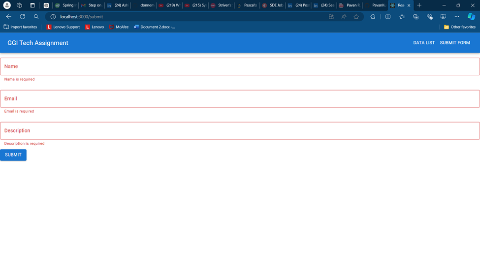
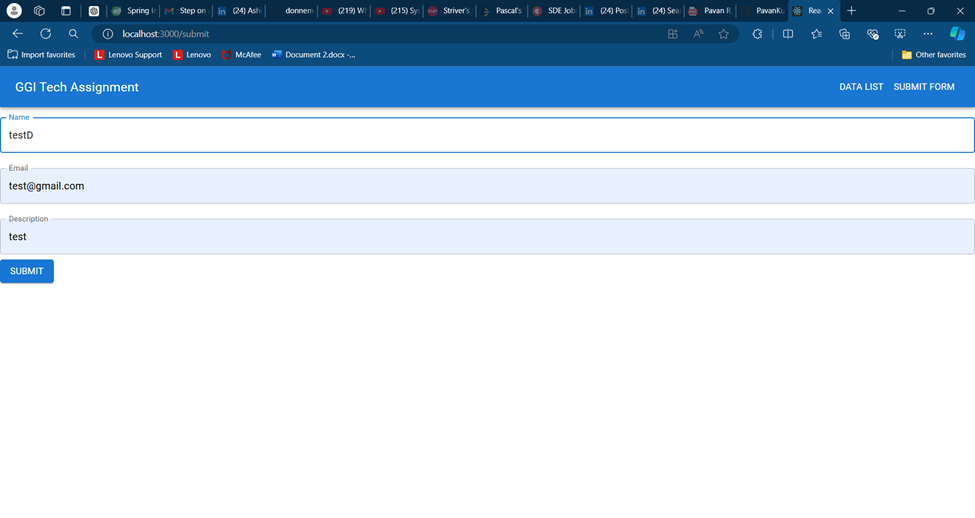
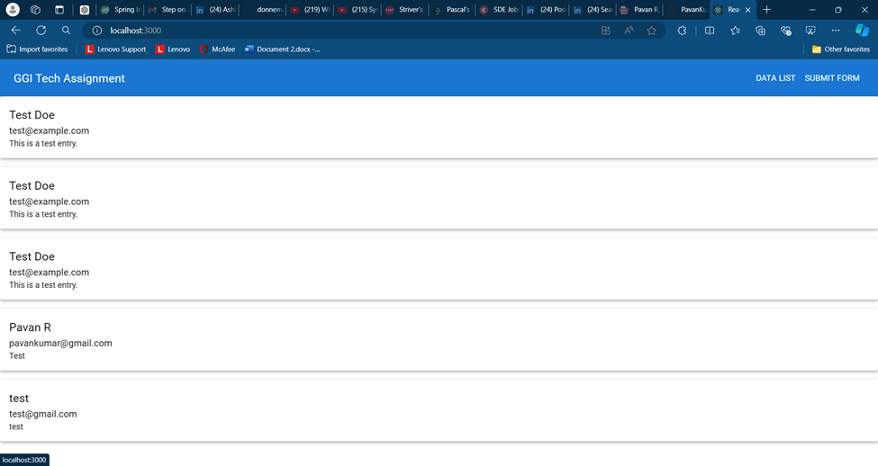

---

### Frontend README

```markdown
# GGI FrontEnd Repository

This repository contains the frontend implementation for the GGI project, built using React. It provides a user interface for interacting with the backend API, allowing users to view and submit data.

## Project Structure

- **src/**
  - **components/**
    - **Header.js**: Contains navigation links to "Data List" and "Submit Form" pages, using Material UI `AppBar` for styling.
    - **DataList.js**: Fetches data from the backend and displays it in a Material UI `Table` or `Grid`.
    - **Form.js**: Provides a form for users to submit new data entries. Validation is handled using `React Hook Form` and `Yup`.
  - **App.js**: The main entry point that sets up routing between components.
  - **index.js**: Entry point for rendering the React application.

## Getting Started

### Prerequisites

- Node.js (v14 or higher)
- npm or yarn

### Installation

1. **Clone the Repository:**
   ```bash
   git clone https://github.com/PavanKumar1127/GGI-FrontEnd-Repository.git
   cd GGI-FrontEnd-Repository


## Screenshots

Here are some screenshots of the application:

### Header Component


### Data List Component



### Form Component



### App Flow


